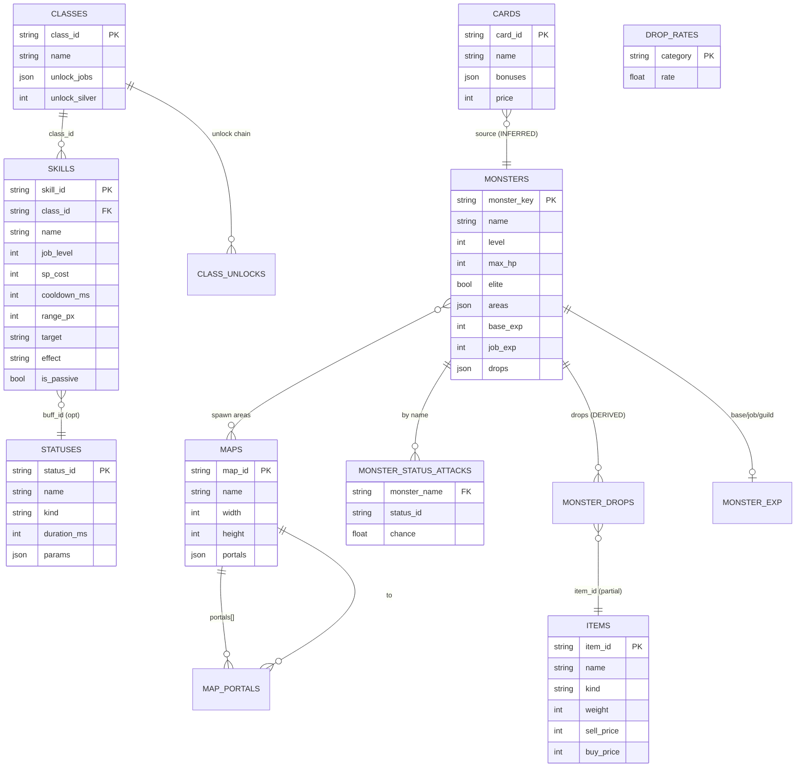

# ER_MODEL.md — Lumivara Entity Relationship

## Catatan

- Relasi MONSTERS→ITEMS via drops bersifat DERIVED (asosiasi posisi event, bukan FK server)
- CARDS→MONSTERS via konvensi penamaan (hopper_card → prism-hopper) — INFERRED
- Tidak ada FK constraint fisik di SQLite (logical model only)
